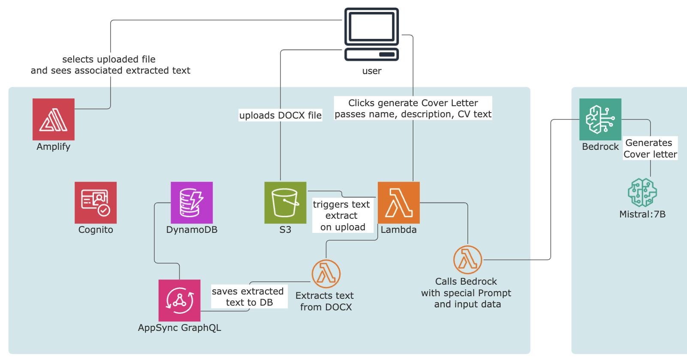

# AWS Amplify React+Vite Job Seeker Journal

This repository provides a web application using React+Vite and AWS Amplify and AWS Bedrock.
This is made for [The AWS Amplify Fullstack Typescript Challenge](https://dev.to/challenges/aws)

## Overview

This is a job seeker journal application. The app helps users keep track of the jobs they have applied for, and store different CVs and Cover letters connected with jobs.
It leverages AWS Amplify authentication, data, file storage, serverless functions, the AWS Amplify UI React library, and AWS Bedrock with the Mistral:7B model to generate cover letter text.

## Features

- **Authentication**: Setup with Amazon Cognito for secure user authentication.
- **API**: Ready-to-use GraphQL endpoint with AWS AppSync.
- **Database**: Real-time database powered by Amazon DynamoDB.
- **Functions**: Serverless functions powered by AWS Lambda.
- **AI**: easy access to AI provided by AWS Bedrock.

 

## Preview

https://github.com/samvimes01/amplify-job-search-diary/assets/4409473/f86cf5fe-9c6b-4a9c-b02b-46dda28bd896

The gif file is about 2 minutes long.

## License

This library is licensed under the MIT-0 License. See the LICENSE file.
